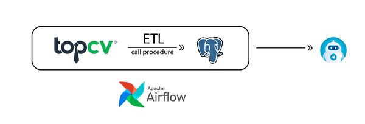
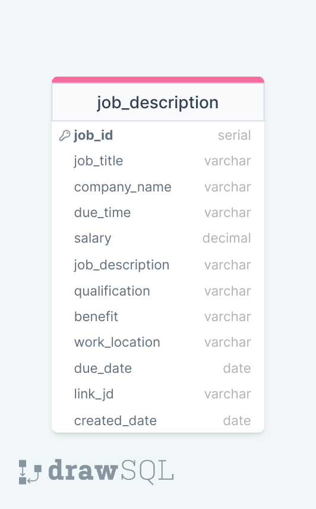
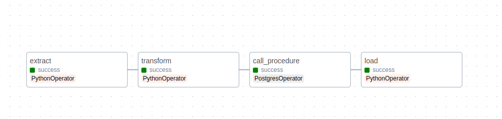
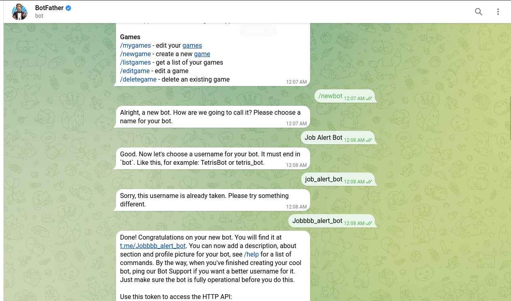
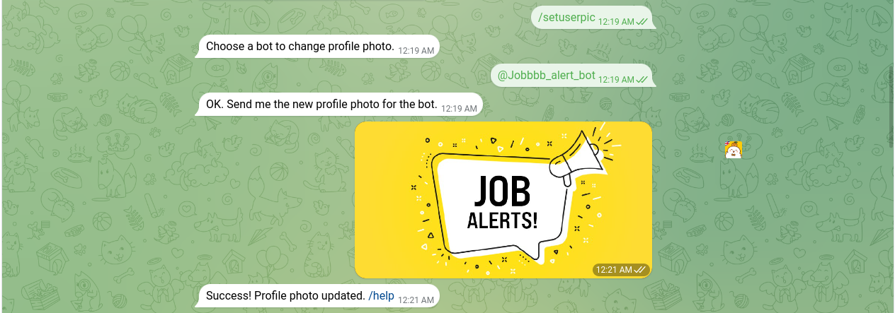
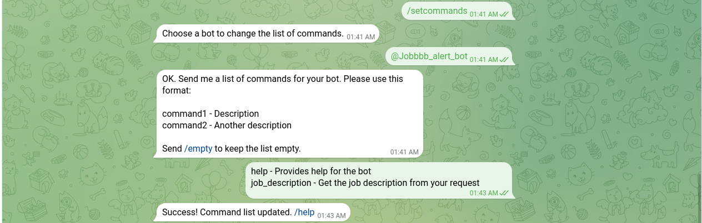
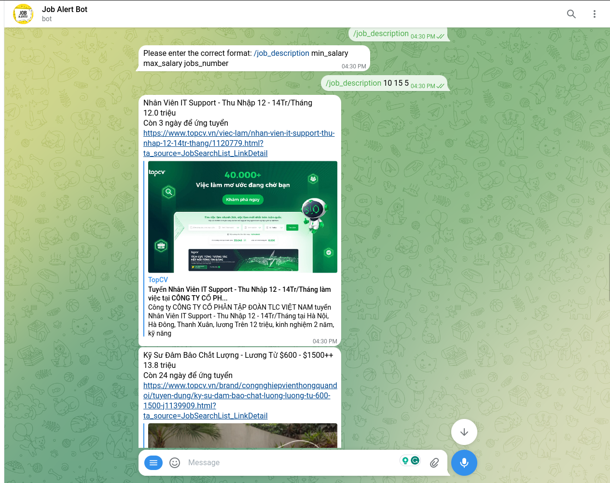

# Telegram Notifier for TopCV Data Pipeline

## Table of Contents
- [Telegram Notifier for TopCV Data Pipeline](#telegram-notifier-for-topcv-data-pipeline)
  - [Table of Contents](#table-of-contents)
  - [1. Introduction](#1-introduction)
    - [Technologies used](#technologies-used)
  - [2. Implementation overview](#2-implementation-overview)
  - [3. Design](#3-design)
  - [4. Project Structure](#4-project-structure)
  - [5. Settings](#5-settings)
    - [Important note](#important-note)
  - [6. Implementation](#6-implementation)
    - [6.1 Load sales data into PostgreSQL database](#61-load-sales-data-into-postgresql-database)
    - [6.2 Create Telegram Bot](#62-create-telegram-bot)
  - [7. Visualize result](#7-visualize-result)
    - [Results](#results)


## 1. Introduction 
The data is collected daily at 10 PM from the TopCV website regarding the latest job descriptions posted on that day. We will build ETL pipelines which will transform raw data from Topcv into actionable insights, store them in OLTP database (PostgreSQL) and using Telegram Bot to notify jobs based on your demand.

### Technologies used
- Python
- PostgreSQL
- Airflow
- Selenium

## 2. Implementation overview
Design data table for OLTP database (PostgreSQL), using Selenium to crawl data from Topcv website. Build an ETL pipeline to transform raw data into actionable insights in PostgreSQL. Using Airflow to orchestrate pipeline workflow.



## 3. Design 
***Data table for Postgres***



## 4. Project Structure

```bash

Job_Pipeline/
  ├── dags/
  │   ├── dags.py
  │   ├── ETL_Topcv_Postgres
  │   │   ├── Extract
  │   │   │   └── extract.py
  │   │   ├── Load
  │   │   │   └── load_postgres.py
  │   │   └── Transform
  │   │       ├── transform_data.py
  ├── Create_Postgres_schema
  │   ├── create_pgsql_schema.py
  │   ├── create_procedure.py  
  ├── picture
  │   └── Many images.png
  ├── Crawled_data
  ├── Transformed_data
  ├── config.cfg
  ├── Implementation detail.md
  └── readme.md
```

## 5. Settings

### Important note

***You must run create_postgres_schema.py and create_procedure.py for each of the following***

- Create_postgres_schema : Create a Postgres table to store transformed data, since loading data into Postgres is a daily task, it's not possible to create a 'create table' task in Airflow  
- Create_procedure : Run the file to create a procedure in the database used in the Airflow task for updating the 'due_date' field

## 6. Implementation

***Airflow dags Graph***


### 6.1 Load sales data into PostgreSQL database



**Airflow tasks**


 ```python
extract_data = PythonOperator(
    task_id= 'extract',
    python_callable= extract,
    dag= dag
)

transfrom = PythonOperator(
    task_id= 'transform',
    python_callable= transform_data,
    dag= dag
)

call_procedure = PostgresOperator(
    task_id= 'call_procedure',
    postgres_conn_id= 'postgres_job_db',
    sql= 'SELECT update_due_time();',
    dag= dag
)

load = PythonOperator(
    task_id= 'load',
    python_callable= Load_schema,
    dag= dag
)
 ``` 
 
***1. extract_data :*** Scrap Data from Topcv website and load into **Crawled_data** for transform and back up.

***2. transfrom :*** Transform raw data from **Crawled_data** and store them in **Transformed_data** folder.

***3. call_procedure :*** Call procedure to update due_time column in job_description table. For example, if on one day the 'due_time' column in a row has a value of 'Còn 24 ngày để ứng tuyển' (24 days left to apply), then the next day that row will be updated to 'Còn 23 ngày để ứng tuyển' (23 days left to apply)

***4. load :*** Load all transformed data into PostgreSQL database.


### 6.2 Create Telegram Bot
Using BotFather to create a new Bot



***1. Set description :*** Set the new description for the bot.

***2. Set userpic :*** Set the new profile photo for the bot.

***3. Set about text :*** Set the new 'About' text. People will see this text on the bot's profile page and it will be sent together with a link to your bot when they share it with someone..

***4. Set commands :*** Set a list of commands for your bot.

Using python-telegram-bot library and API TOKEN to connect and progame that Bot (Details are in the Telegram_Bot folder)

***5. Start and Help commands :***
```python
async def start_command(update: Update, context: ContextTypes.DEFAULT_TYPE):
    await update.message.reply_text(f'Hello {update.effective_user.first_name}!, Welcome to the bot')

async def help_command(update: Update, context: ContextTypes.DEFAULT_TYPE):
    await update.message.reply_text('How can I help you?')
```

***6. job_description commands :***
First, we must create connect_postgres and query function to return list of Job descriptions we demand.
```python
def execute_sql_query(sql_query):
    connect_params = {
        "host" : HOST,
        "dbname" : DB_NAME,
        "user" : DB_USER,
        "password" : DB_PASSWORD
    }
    conn = psycopg2.connect(**connect_params)
    cur = conn.cursor()
    conn.set_session(autocommit= True)

    cur.execute(sql_query)
    result = cur.fetchall()
    cur.close()
    conn.close()
    return result
```

After that, we create a job_description function for the bot to send messages. We use the format "/job_description min_salary max_salary jobs_number" if you send an incorrect message, the bot will send "Please enter the correct format: /job_description min_salary max_salary jobs_number"
```python
async def get_job_description(update: Update, context: CallbackContext):
    try:
        min_salary = context.args[0]
        max_salary = context.args[1]
        jobs_number = context.args[2]
        sql_query = f"""
            SELECT job_title, salary || ' triệu' ,due_time, link_jd FROM job_description
            WHERE salary between '{min_salary}' and '{max_salary}'
            AND work_location like '%Hà Nội%'
            ORDER BY due_date, salary DESC
            limit '{jobs_number}'
            """

        results = execute_sql_query(sql_query)
        for result in results: 
            await update.message.reply_text(result[0] + "\n" + result[1] + "\n" + result[2] + "\n" + result[3])
    except:
        await update.message.reply_text("Please enter the correct format: /job_description min_salary max_salary jobs_number")

```
## 7. Visualize result

### Results

**Help Command**

  
**Job_description Command**


  
